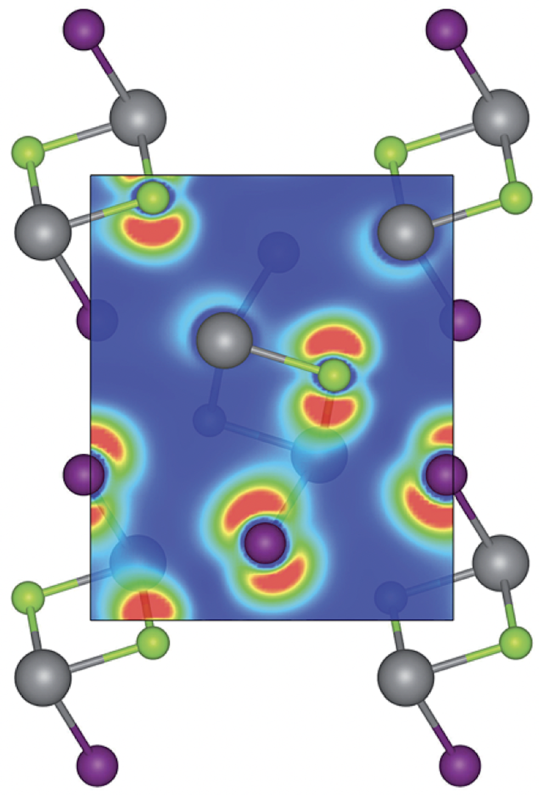
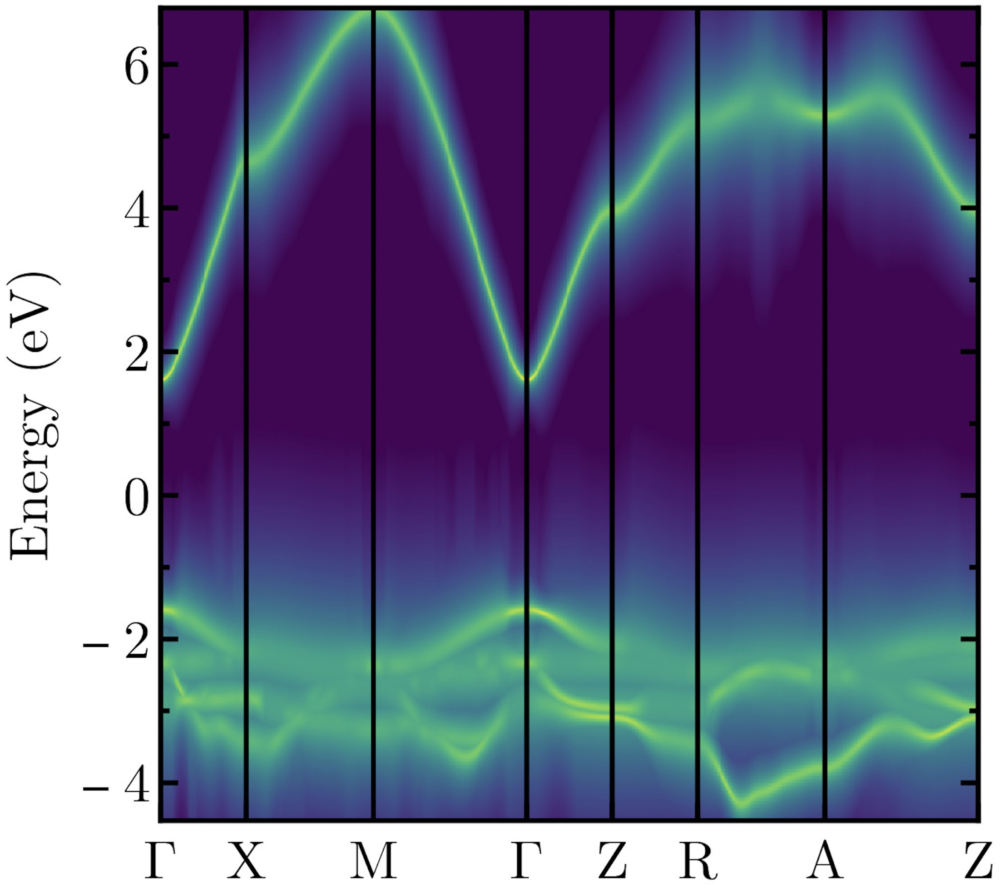

Welcome to the Virtual Atoms Lab research group run by [Dr Alex Ganose](/team) at
[Imperial College London](https://www.imperial.ac.uk).
We use computational materials chemistry, data-driven approaches, and machine learning to discover new
functional materials for photovoltaics, thermoelectrics, and more.
We develop a suite of open-source codes to help tackle these challenges. See the [codes page](http://localhost:1313/codes/)
for more details.

We are members of the Institute for Digital Molecular Design and Fabrication ([DigiFAB][digifab]), the Thomas Young Centre ([TYC][tyc]) for Materials Modelling, the Centre for Plastic Electronics ([CPE][cpe]), the [Artificial Intelligence Network][ainet], and the [Materials Project](https://materialsproject.org).

If you're interested in joining the group, please see the [Join Us page](/join) for current opportunities.

## Photovoltaics

:   We design new earth-abundant materials for use in solar cells.
    We focuss on defect-tolerant materials that can still show high effieciency even
    when using low-cost processing methods.
    Using a data-driven approach we can screen large libraries of crystals and we also
    generate our own datasets using high-throughput first-principles calculations.

    

    **Relevant publication**: "The defect challenge of wide-bandgap semiconductors for photovoltaics and beyond" [Nature Communications (2022)](https://doi.org/10.1038/s41467-022-32131-4)

## Electron-phonon interactions

:   The electron–phonon interaction is a cornerstone of solid-state physics and
    controls the charge carrier mobility in semiconductors.
    We recently developed a new method to calculate electron–phonon and electron–defect
    interactions that is 500 times more efficient than existing methods.
    We've used it for the widescale screening of carrier lifetimes in 23,000 materials.
    We are currently applying it to discover new thermoelectric materials.

    

    **Relevant publication**: "Efficient calculation of carrier scattering rates from first principles" [Nature Communications (2021)](https://doi.org/10.1038/s41467-021-22440-5)

## Machine learning for chemistry

:   Machine learning (ML) is a powerful tool for accelerating materials discovery.
    We build computational databases of materials properties and apply
    ML to extract chemical trends, predict the properties of
    unseen materials, and generate completely new crystal structures.
    We are particularly interested in applying ML to predict complex
    tensor properties of crystals such as dielectric and elastic properties.

    

    **Relevant publication**: "Learned Force Fields Are Ready For Ground State Catalyst Discovery" [arXiv:2209.12466](https://arxiv.org/abs/2209.12466)

[digifab]: https://www.imperial.ac.uk/a-z-research/digital-molecular-design-and-fabrication/
[tyc]: https://thomasyoungcentre.org
[cpe]: https://www.imperial.ac.uk/a-z-research/processable-electronics/plastic-electronics-cdt/
[ainet]: https://www.imperial.ac.uk/artificial-intelligence
