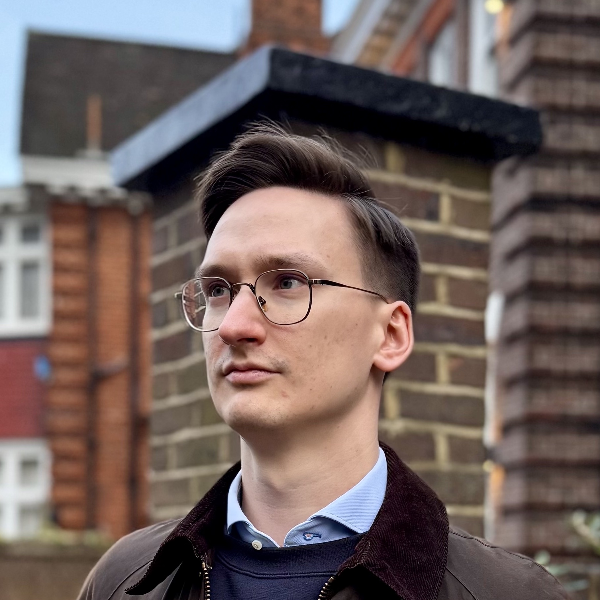

:   ## Dr. Alex Ganose

    Lecturer, Imperial College London

    Co-investigator, [Materials Project](https://materialsproject.org)

    

    <a href="https://www.imperial.ac.uk/people/a.ganose">Website</a> |
    <a href="https://scholar.google.com/citations?user=nVJFXWwAAAAJ&hl=en">Scholar</a> |
    <a href="https://github.com/utf">GitHub</a>

    

    Alex Ganose is a Lecturer and EPSRC Fellow in the Department of Chemistry at Imperial College London.

    

    His research uses computational materials chemistry, machine learning,
    and data science to design new materials for pressing  problems,
    including renewable energy generation (photovoltaics & thermoelectrics) and
    energy storage.

    

    Alex was awarded his EngD in chemistry from University College London in 2018.
    After a Postdoctoral position at
    Berkeley Lab, California he joined Imperial as an EPSRC Fellow in 2021.
    In 2022, he was appointed as a Lecturer in the Department of Chemistry.
    He is a co-investigator at the [Materials Project](http://materialsproject.org).

    

    You can contact Dr Alex Ganose [by email](mailto:a.ganose@imperial.ac.uk).

## Senior Researchers

:   ## Dr Xinwei Wang

    Project: *Accelerated defect modelling with machine learning*

    

    <a href="https://scholar.google.com/citations?user=Ul36LhUAAAAJ&hl=en&oi=ao">Scholar</a> |
    <a href="https://github.com/xw-w">GitHub</a>

    

    Xinwei Wang is an Eric and Wendy Schmidt AI in Science Postdoctoral Fellow in the Department of Chemistry at
    Imperial College London. She obtained her PhD in Materials from the same institution. Her research interests
    are accelerating the identification and optimisation of emerging solar absorbers using data-driven approaches.
    During her fellowship, she's focused on using AI and machine learning techniques to advance defect modelling.
    In her free time, Xinwei enjoys photography and hiking.

:   ## Dr Federico Ottomano

    Project: *Mixed modality generative AI for molecules and materials*

    

    <a href="https://fedeotto.github.io">Website</a> |
    <a href="https://scholar.google.com/citations?user=aCAlBk8AAAAJ&hl=en">Scholar</a> |
    <a href="https://github.com/fedeotto">GitHub</a>

    

    Federico obtained a Ph.D. in Computer Science from the University of Liverpool, where he worked in the domain of
    AI4Science, specializing in AI-driven materials discovery. His research interests include graph neural networks
    and deep generative models with applications in the Chemistry domain, targeting the generation of molecules and
    materials. He joined the AIchemy AI for Chemistry Hub as a postdoc in Jan 2025. In his free time, he enjoys playing jazz piano.

:   ## Dr Wojciech Stark

    Project: *Multi-fidelity closed-loop Bayesian optimisation of chemical experiments*

    

    <a href="http://wgst.github.io">Website</a> |
    <a href="https://scholar.google.com/citations?user=KiNdem8AAAAJ">Scholar</a> |
    <a href="https://github.com/wgst">GitHub</a>

    

    Wojciech obtained his PhD in Chemistry from University of Warwick, where he developed machine learning models for
    gas-surface dynamics using uncertainty-driven adaptive sampling. In 2025, he joined Imperial as a Research Associate
    in AI for Chemistry, focusing on multi-fidelity closed-loop Bayesian optimisation for chemical experiments. In his
    free time, Wojciech enjoys fitness activities, attending operas, and watching stand-up comedy.

## PhD Students

:   ## Ruiqi Wu

    Project: *Designing novel photovoltaics through machine learning*

    

    <a href="https://scholar.google.com/citations?user=ZBw2oKYAAAAJ&hl=en">Scholar</a>

    

    Ruiqi grew up in China, from a small city where Tofu is believed to originate from.
    She obtained undergraduate degrees in Materials Engineering at both the University
    of British Columbia (Canada) and Chongqing University (China) where she investigated metal
    processing, batteries and transistors. After graduating with a distinction in
    Advanced Materials Science from UCL, Ruiqi joined the group in November 2022 as
    the first PhD student, focusing on designing earth-abundant photovoltaics.
    When she’s not studying, Ruiqi enjoys cooking, manga and fossil hunting.

:   ## Yifan Wu

    Project: *Accelerating materials synthesis and computation*

    Co-supervisor: *Prof. Aron Walsh*

    

:   ## Irea Mosquera Louis

    Project: *Defect representations in solid-state materials*

    Co-supervisor: *Prof. Aron Walsh*

    

:   ## Leo Lou

    Project: *Machine learning to accelerate the discovery of energy materials*

    

    <a href="https://github.com/leolou0512">GitHub</a>

    

    Leo is a second year PhD student in the Virtual Atoms Group. He joined the group in 2022 as a Masters
    student as part of his undergraduate degree, and continued as a PhD student in 2023. Since then, he
    has been applying machine learning to problems in chemistry and materials. He is currently working on
    generative models for crystalline materials. Leo is an amateur classical pianist, Magic the Gathering
    player, and an enthusiast for PC games.

:   ## Shirui Wang

    Project: *Finite-temperature materials discovery*

    

    Shirui Wang graduated with a Bachelor of Science degree in Chemistry from the University of
    Birmingham in July 2022. He then completed a Master of Research (MRes) in Nanomaterials at
    Imperial College with distinction. Shirui joined the group in December 2022 as a master student,
    working on a project titled Computational Insights into Emerging Chalcogenide Perovskite Photovoltaics.
    Following the completion of his master, he continued with the group as a PhD student, now focusing on
    replacing heavy DFT calculations with machine learning techniques.

:   ## Viktor Ellingsson

    Project: *Halide solid electrolytes for all-solid-state batteries*

    

    Viktor is a President’s PhD Scholar in the Department of Chemistry at Imperial College London.

    

    Viktor is from Iceland and graduated with a BSc in Chemistry with a focus on computational techniques
    from the University of Iceland. His BSc project looked at the computationally aided design of ammonia
    NRR catalysts with Prof. Egill Skúlason in collaboration with Atmonia. After the BSc degree he spent one
    year in the United States at the University of California Santa Barbara attending the UCSB Extension program.
    In 2022, he joined the STEM Group at the University of Oxford supervised by P. D. Nellist, R. J. Nicholls, and
    P. G. Bruce. At Oxford he explored the redox mechanism of disordered rocksalt Li-ion cathode materials using
    electron microscopy and computational modelling. Viktor joined the Virtual Atoms Lab group in November 2023.
    In his spare time, Viktor enjoys reading, listening to music, and brewing coffee as well as playing Badminton.

## Visiting Students

:   ## Ling Zhang

    

    Ling is from Henan, China, and she will study at IC as a joint PhD student for 12 months.
    She is currently a PhD student at Beihang University, China, and her PhD project focuses on
    the polaronic defects in oxides. Now at IC, Ling will start a new project focused on defects in
    ultra-wide band gap semiconductors under the supervision of Dr. Alex Ganose. Ling enjoys running,
    reading and watching movies at her free time.

## Masters Students

:   ## Thomas Selby

    Project: *Fine-tuning universal force fields through uncertainty quantification*

    

    Thomas is from Chesterfield, England, and is a masters student studying chemistry with molecular physics,
    also completing a year in industry as an analytical chemist with GSK. His project is focused on fine-tuning
    universal force fields through uncertainty quantification. In his spare time, Thomas plays football for Imperial's
    first team.

:   ## Jiawen Han

    Project: *Computational screening of emerging chalcogenide photovoltaics*

    

    Jiawen began her studies at Imperial as an undergraduate in chemistry. She joined the research group in 2024 and
    is currently working on her master's research project, which focuses on the computational screening of next-generation
    chalcogenide photovoltaic materials. Outside of her academic pursuits, Jiawen is passionate about creativity and adventure.
    She is an amateur music composer, a cook who enjoys exploring world cuisines, a travel enthusiast, and an avid skater.

:   ## Katrina Zhong

    Project: *Crystal structure prediction with universal force fields*

    

:   ## Tianyu Xu

    Project: *Machine learning of dielectric tensors*

    

    Tianyu is a fourth-year MSci student who want to deepen his understanding of DFT and machine learning,
    with a focus on training a universal model for predicting dielectric properties. He also has a strong
    interest in history and warships, particularly the World War II part.

:   ## Hollie Kelvin

    Project: *Investigating materials for far-UVC technology*

    

    Hollie is from Essex and is currently an MRes Nanomaterials student at Imperial College. After graduating
    with a first-class Hons (BSc) in Chemistry from the University of Nottingham, she joined Imperial in 2024
    to pursue her MRes, with a project focused on exploring promising materials for applications in far-UVC
    technology. Outside of her research, Hollie enjoys artistic activities, exploring the vibrant city of London
    and learning new skills such as playing the ukulele.

